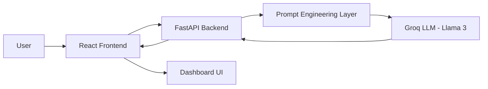
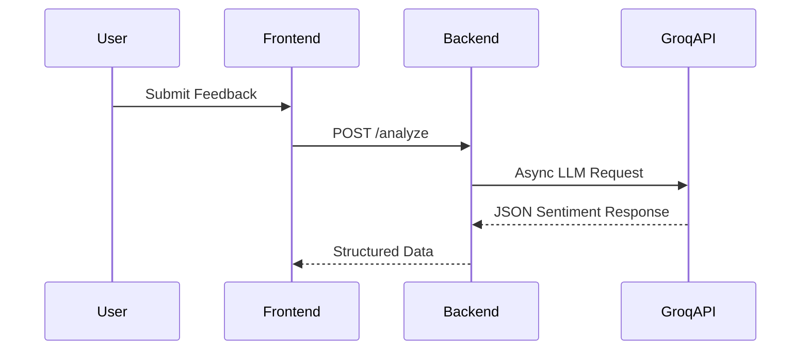
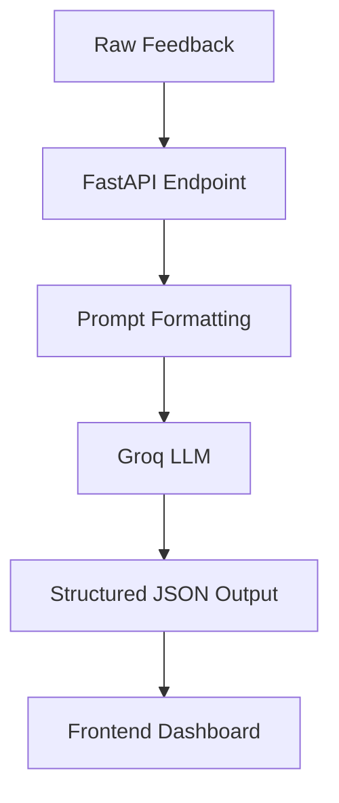
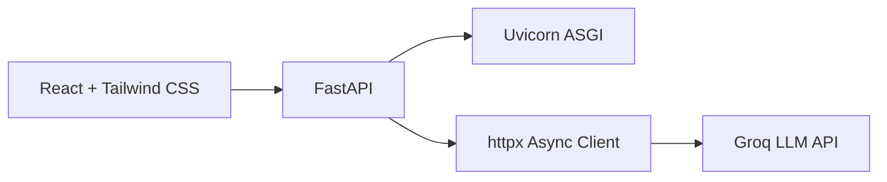

# 🎓 Vibe Check: AI Student Feedback Analyzer

<p align="center">
AI-Powered Real-Time Sentiment Intelligence for Universities
</p>

---

# 🧠 1. Project Overview

**Project Name:** Vibe Check AI  
**One-Liner:** An AI-powered dashboard for universities to instantly categorize and analyze student feedback vibes for better campus management.

## 🚨 Problem

Universities receive large volumes of unstructured student feedback that:

- Is difficult to manually categorize  
- Lacks structured insights  
- Is not scalable for real-time analysis  

## ✅ Solution

Vibe Check AI:

- Accepts raw textual feedback  
- Uses LLM-based inference for structured sentiment classification  
- Returns JSON-formatted responses  
- Displays categorized results on a dynamic dashboard  
- Operates fully on free-tier cloud infrastructure  

---

# 🏗️ 2. Technical Architecture

## 🔹 System Architecture



---

## 🔹 Backend Concurrency Architecture



---

## 🔹 Data Flow Pipeline



---

# ☁️ 3. Zero-Cost Cloud Usage

| Service | Usage | Free Tier | Purpose |
|----------|--------|------------|----------|
| Netlify | Frontend Hosting | 100GB/month | React Deployment |
| Render | Backend Hosting | 750 hours/month | FastAPI API |
| Groq Cloud | LLM Inference | 14K tokens/min | Sentiment Analysis |
| Uvicorn | ASGI Server | Free | Concurrency |

### 💰 Total Operating Cost: $0.00

The backend uses **ASGI async request handling** with `httpx` for non-blocking LLM calls, allowing 800+ concurrent requests within free-tier limits.

---

# 🧩 4. Core Technology Stack



---

## 🔍 Detailed Stack

| Layer | Technology | Version |
|-------|------------|----------|
| Frontend | React | 19 |
| Styling | Tailwind CSS | 4 |
| Animation | Framer Motion | Latest |
| Backend | FastAPI | Latest |
| Runtime | Python | 3.12 |
| HTTP Client | httpx | Async |
| LLM Provider | Groq | Llama-3-8b-8192 |

---

# 🔗 5. Important Links

Live Demo:  
https://nlp-sentiment-analysis.netlify.app/

GitHub Repository:  
https://github.com/kaushlendra0607/NLP_Sentiment_Analysis

---

# 🛠️ 6. Installation & Setup

## Backend

```bash
cd backend
python -m venv venv
.\venv\Scripts\activate   # Windows
pip install -r requirements.txt
```

Create `.env` file:

```
AI_PROVIDER_API_KEY=your_key_here
API_KEY_SECRET=your_secret_here
```

Run server:

```bash
uvicorn main:app --reload
```

---

## Frontend

```bash
cd frontend
npm install
```

Create `.env` file:

```
VITE_API_URL=https://nlp-sentiment-analysis.netlify.app/
VITE_API_KEY=nlp_api_key_2580
```

Run:

```bash
npm run dev
```

---

# 🚀 7. Performance Features

- Async non-blocking LLM calls  
- Stateless architecture  
- Free-tier optimized  
- Horizontal scaling ready  

---

# 🔐 8. Security

- Environment-based API key storage  
- Backend validation layer  
- No direct frontend exposure of LLM  

---

# 👨‍💻 Author

Kaushlendra Singh  
AI | Cloud | Full Stack Developer