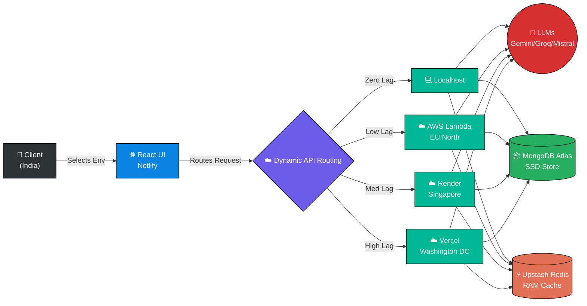
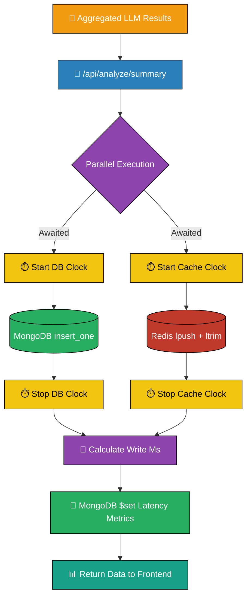
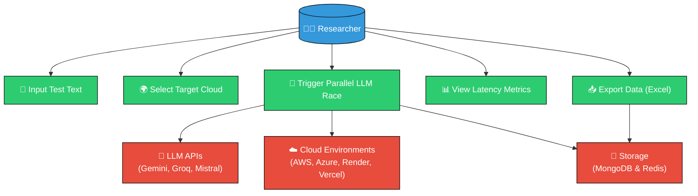

# ⚡ AI & Cloud Infrastructure Benchmarking Architecture

<p align="center">
A Full-Stack Research System for LLM Inference, Geographic Cloud Latency, and Database Ingestion Speed
</p>

<p align="center">
<a href="https://www.python.org/">
  
</a>
<a href="https://fastapi.tiangolo.com/">
  
</a>
<a href="https://react.dev/">
  
</a>
<a href="https://redis.io/">
  
</a>
<a href="https://www.mongodb.com/">
  
</a>
<a href="https://www.docker.com/">
  
</a>
<a href="https://aws.amazon.com/">
  
</a>
<a href="https://cloud.google.com/">
  
</a>
<a href="https://github.com/kaushlendra-pt-singh/NLP_Sentiment_Analysis/blob/main/LICENSE">
  
</a>
</p>

---

# 🧠 1. Project & Research Overview

**Project Name:** AI & Cloud Latency Benchmark Suite  
**One-Liner:** An enterprise-grade FastAPI and React architecture designed to scientifically measure LLM speeds, cross-continental network lag, and RAM vs. SSD database ingestion rates.

## 🚨 The Research Problem
When evaluating AI applications, developers often look solely at the LLM's speed. However, real-world application speed is bottlenecked by three hidden factors:
1. **Model Compute Time:** How fast does the LLM actually process the prompt?
2. **Geographic Network Overhead:** How much time is wasted transmitting data from the client to a cloud server (e.g., India to US East)?
3. **Database I/O:** How long does it take to safely persist the AI's response to disk (SSD) versus memory (RAM)?

## ✅ The Solution
This architecture serves as a distributed stopwatch system. It processes sentiment analysis tasks through multiple LLMs simultaneously, calculates real-time network lag across different cloud deployments, and runs parallel write-races between MongoDB Atlas and Upstash Redis. 

---

# 🏗️ 2. Technical Architecture

## 🔹 Multi-Cloud System Architecture
The frontend acts as a dynamic testing terminal, allowing the user to route requests to backends deployed across the globe to measure geographic speed-of-light constraints.

```mermaid
flowchart LR
    A["👤 Client<br/>(India)"]:::user -->|Selects Env| B["🌐 React UI<br/>Netlify"]:::frontend
    B -->|Routes Request| C{"☁️ Dynamic API Routing"}:::router
    
    C -->|Zero Lag| D["💻 Localhost"]:::backend
    C -->|Low Lag| E["☁️ AWS Lambda<br/>EU North"]:::backend
    C -->|Med Lag| F["☁️ Render<br/>Singapore"]:::backend
    C -->|High Lag| G["☁️ Vercel<br/>Washington DC"]:::backend

    D & E & F & G --> H(("🧠 LLMs<br/>Gemini/Groq/Mistral")):::llm
    D & E & F & G --> I[("📦 MongoDB Atlas<br/>SSD Store")]:::db
    D & E & F & G --> J[("⚡ Upstash Redis<br/>RAM Cache")]:::cache

    classDef user fill:#2d3436,stroke:#000000,color:#ffffff;
    classDef frontend fill:#0984e3,stroke:#000000,color:#ffffff;
    classDef router fill:#6c5ce7,stroke:#000000,color:#ffffff;
    classDef backend fill:#00b894,stroke:#000000,color:#ffffff;
    classDef llm fill:#d63031,stroke:#000000,color:#ffffff;
    classDef db fill:#27ae60,stroke:#000000,color:#ffffff;
    classDef cache fill:#e17055,stroke:#000000,color:#ffffff;
```

---

## 🔹 The "Insert-Measure-Update" Pipeline

A highly synchronized async pipeline designed to measure the raw ingestion speed of Disk (MongoDB) vs. RAM (Redis) without network interference.

```mermaid
flowchart TD
    A["📝 Aggregated LLM Results"]:::input --> B["🚀 /api/analyze/summary"]:::api
    
    B --> C{"Parallel Execution"}:::logic
    
    C -->|Awaited| D["⏱️ Start DB Clock"]:::clock
    D --> E[("MongoDB insert_one")]:::mongo
    E --> F["⏱️ Stop DB Clock"]:::clock
    
    C -->|Awaited| G["⏱️ Start Cache Clock"]:::clock
    G --> H[("Redis lpush + ltrim")]:::redis
    H --> I["⏱️ Stop Cache Clock"]:::clock
    
    F & I --> J["🧮 Calculate Write Ms"]:::logic
    J --> K["🔄 MongoDB $set Latency Metrics"]:::mongo
    K --> L["📊 Return Data to Frontend"]:::output

    classDef input fill:#f39c12,stroke:#000000,color:#ffffff;
    classDef api fill:#2980b9,stroke:#000000,color:#ffffff;
    classDef logic fill:#8e44ad,stroke:#000000,color:#ffffff;
    classDef clock fill:#f1c40f,stroke:#000000,color:#000000;
    classDef mongo fill:#27ae60,stroke:#000000,color:#ffffff;
    classDef redis fill:#c0392b,stroke:#000000,color:#ffffff;
    classDef output fill:#16a085,stroke:#000000,color:#ffffff;
```

---

## 🔹 User Interaction Flow

This diagram outlines the system boundaries and how the researcher interacts with the distributed architecture.

```mermaid
flowchart TD
    A[("👨‍🔬 Researcher")]:::user
    
    A --> B["📝 Input Test Text"]:::action
    A --> C["🌍 Select Target Cloud"]:::action
    A --> D["🚀 Trigger Parallel LLM Race"]:::action
    A --> E["📊 View Latency Metrics"]:::action
    A --> F["📥 Export Data (Excel)"]:::action
    
    D --> G["🤖 LLM APIs<br/>(Gemini, Groq, Mistral)"]:::external
    D --> H["☁️ Cloud Environments<br/>(AWS, Azure, Render, Vercel)"]:::external
    D --> I["💾 Storage<br/>(MongoDB & Redis)"]:::external
    
    F --> I

    classDef user fill:#3498db,stroke:#000000,color:#ffffff;
    classDef action fill:#2ecc71,stroke:#000000,color:#ffffff;
    classDef external fill:#e74c3c,stroke:#000000,color:#ffffff;
```

---

# 📊 3. Core Research Metrics

This system mathematically isolates and calculates three distinct metrics:

1. **AI Processing Latency (`api_latency_ms`):** Measured natively by the LLM providers, indicating the pure time spent generating tokens.
2. **Cloud Network Overhead (`cloud_network_overhead_ms`):** Calculated on the frontend using the formula:
   > Total Roundtrip Time - LLM Processing Time = Cloud Network Overhead
3. **Database vs. Cache Speed (`db_write_ms` vs `cache_write_ms`):** Measured internally by the FastAPI backend to prove the I/O speedup factor of in-memory caching.

---

# ☁️ 4. Multi-Cloud Deployment Strategy

To capture accurate geographic latency data, the stateless FastAPI backend is containerized via Docker and deployed across multiple cloud environments.

| Environment | Provider | Region | Expected Latency Impact |
|-------------|----------|--------|------------------------|
| **Origin UI** | Netlify | Global CDN | Base Metric |
| **Local** | Localhost | Local Machine | ~0ms (Control Group) |
| **Cloud A** | AWS Lambda | EU North (eu-north-1) | Low Lag (European) |
| **Cloud B** | Render | Singapore (ap-southeast-1) | Med Lag (Asia-Pacific) |
| **Cloud C** | Vercel | Washington DC (us-east-1) | High Lag (North America) |
| **Cloud D** | Azure | West Europe | Med Lag (European) |

---

# 🔍 5. Detailed Technology Stack

| Layer | Technology | Version | Purpose |
|-------|-----------|---------|---------|
| **Frontend** | React | 19.x | Dynamic Environment UI & Charting |
| **Backend** | FastAPI | 0.129.x | High-Performance Async API |
| **Database** | MongoDB (Motor) | Async | Persistent Document Storage (SSD) |
| **Cache** | Redis (redis.asyncio) | 7.x | High-Speed Telemetry Queue (RAM) |
| **Container** | Docker | Latest | Universal Cloud Deployment |
| **AI Models** | Groq, Gemini, Mistral | Varies | Sentiment Analysis Targets |

---

# 🔗 6. Live Deployments & Documentation

<p align="center">
<a href="https://nlp-sentiment-analysis.netlify.app/">
  
</a>
<a href="https://nlp-sentiment-analysis-r8t3.vercel.app/docs">
  
</a>
<a href="https://github.com/kaushlendra-pt-singh/NLP_Sentiment_Analysis">
  
</a>
</p>

### 🌐 Backend Endpoints:
- **AWS Lambda (EU North):** https://zt35e7cybhe3a752brelliovge0bwvqy.lambda-url.eu-north-1.on.aws/
- **Render (Singapore):** https://nlp-sentiment-analysis-ksgs.onrender.com/
- **Vercel (Washington DC):** https://nlp-sentiment-analysis-r8t3.vercel.app/
- **Azure (West Europe):** https://nlp-research-backend.azurewebsites.net/

---

# 🛠️ 7. Installation & Setup

### 🐳 Option A: Docker (Production / Cloud Deployment)
```bash
# Build the universal container
docker build -t latency-research-backend .

# Run the container locally mapped to port 8080
docker run -p 8080:8080 --env-file .env latency-research-backend
```

### 💻 Option B: Local Python Development

**Backend:**
```bash
cd backend
python -m venv venv
source venv/bin/activate  # Or .\venv\Scripts\activate on Windows
pip install -r requirements.txt

# Start the ASGI server
uvicorn main:app --reload
```

**Frontend:**
```bash
cd frontend
npm install
npm run dev
```

### 🔑 Environment Variables (`.env`)
```ini
# Backend Credentials
MONGO_URI=mongodb+srv://...
REDIS_URL=rediss://...
GEMINI_API_KEY=your_key
GROQ_API_KEY=your_key
MISTRAL_API_KEY=your_key

# Research Context
CLOUD_PROVIDER=Localhost  # Options: AWS_Lambda, Azure, Render_Singapore, Vercel_DC
ENV_TAG=Development       # Options: Production, Research_Phase_1

# Security
API_KEY_SECRET=dev-test-key-2580
```

---

# 🚀 8. Performance & Security Features

- **Strict Async/Await Isolation:** Utilizes `redis.asyncio` and `motor` to ensure database stopwatches are not blocked by the Python GIL or synchronous socket calls.
- **Math-Adjusted Telemetry:** Cache measurement logic isolates and subtracts "housekeeping" tasks (like `ltrim`) to ensure a scientifically fair `lpush` vs `insert_one` comparison.
- **Environment Agnostic:** Zero hardcoded paths. The frontend dynamically alters its Axios base URLs via state management to ping different global clouds based on user selection.
- **CORS & Security Headers:** Properly configured for production multi-origin deployments.

---

# 📈 9. Research Insights

This system enables quantitative analysis of:
- **LLM Speed Variations:** Compare Gemini Flash, Groq Llama, and Mistral across identical prompts
- **Geographic Latency Impact:** Measure how distance affects API response times
- **Storage Trade-offs:** Quantify the speed difference between persistent storage (MongoDB) and in-memory caching (Redis)

---

# 🤝 10. Contributing

Contributions are welcome! Please feel free to submit a Pull Request. For major changes, please open an issue first to discuss what you would like to change.

1. Fork the repository
2. Create your feature branch (`git checkout -b feature/AmazingFeature`)
3. Commit your changes (`git commit -m 'Add some AmazingFeature'`)
4. Push to the branch (`git push origin feature/AmazingFeature`)
5. Open a Pull Request

---

# 📄 11. License

This project is licensed under the MIT License - see the [LICENSE](LICENSE) file for details.

Copyright © 2024-2025 Kaushlendra Pratap Singh. All rights reserved.

---

# 👨‍💻 12. Author

**Kaushlendra Pratap Singh**  
*AI Engineer | Cloud Infrastructure Specialist | Full Stack Developer*

<p align="left">
<a href="https://github.com/kaushlendra-pt-singh">
  
</a>
<a href="https://www.linkedin.com/in/kps2004/">
  
</a>
</p>

---

<p align="center">
Made with ❤️ for the AI Research Community
</p>