# 🎓 Vibe Check: AI Student Feedback Analyzer

<p align="center">
AI-Powered Real-Time Sentiment Intelligence for Universities
</p>

<p align="center">

<a href="https://www.python.org/">
  
</a>

<a href="https://fastapi.tiangolo.com/">
  
</a>

<a href="https://react.dev/">
  
</a>

<a href="https://tailwindcss.com/">
  
</a>

<a href="https://groq.com/">
  
</a>

<a href="https://render.com/">
  
</a>

<a href="https://www.netlify.com/">
  
</a>

</p>

---

# 🧠 1. Project Overview

**Project Name:** Vibe Check AI  
**One-Liner:** An AI-powered dashboard for universities to instantly categorize and analyze student feedback vibes for better campus management.

## 🚨 Problem

Universities receive large volumes of unstructured student feedback that:

- Is difficult to manually categorize  
- Lacks structured insights  
- Is not scalable for real-time analysis  

## ✅ Solution

Vibe Check AI:

- Accepts raw textual feedback  
- Uses LLM-based inference for structured sentiment classification  
- Returns JSON-formatted responses  
- Displays categorized results on a dynamic dashboard  
- Operates fully on free-tier cloud infrastructure  

---

# 🏗️ 2. Technical Architecture

## 🔹 System Architecture

```mermaid
flowchart LR

    A[👤 User]:::user --> B[⚛ React Frontend]:::frontend
    B --> C[🚀 FastAPI Backend]:::backend
    C --> D[🧠 Prompt Layer]:::logic
    D --> E[🔥 Groq LLM - Llama 3]:::llm
    E --> C
    C --> B
    B --> F[📊 Dashboard UI]:::frontend

    classDef user fill:#f9c74f,stroke:#333,color:#000;
    classDef frontend fill:#61dafb,stroke:#333,color:#000;
    classDef backend fill:#43aa8b,stroke:#333,color:#fff;
    classDef logic fill:#577590,stroke:#333,color:#fff;
    classDef llm fill:#f3722c,stroke:#333,color:#fff;
```



---

## 🔹 Data Flow Pipeline

```mermaid
flowchart TD

    A[📝 Raw Feedback]:::input --> B[🚀 FastAPI Endpoint]:::backend
    B --> C[🧠 Prompt Formatting]:::logic
    C --> D[🔥 Groq LLM]:::llm
    D --> E[📦 JSON Output]:::output
    E --> F[📊 Dashboard]:::frontend

    classDef input fill:#f9c74f,stroke:#333,color:#000;
    classDef backend fill:#43aa8b,stroke:#333,color:#fff;
    classDef logic fill:#577590,stroke:#333,color:#fff;
    classDef llm fill:#f3722c,stroke:#333,color:#fff;
    classDef output fill:#90be6d,stroke:#333,color:#000;
    classDef frontend fill:#61dafb,stroke:#333,color:#000;
```



---

## 🔹 Core Technology Stack

```mermaid
flowchart LR

    A[⚛ React + Tailwind]:::frontend --> B[🚀 FastAPI]:::backend
    B --> C[⚡ Uvicorn ASGI]:::backend
    B --> D[🔗 httpx Async Client]:::logic
    D --> E[🔥 Groq LLM API]:::llm

    classDef frontend fill:#61dafb,stroke:#333,color:#000;
    classDef backend fill:#43aa8b,stroke:#333,color:#fff;
    classDef logic fill:#577590,stroke:#333,color:#fff;
    classDef llm fill:#f3722c,stroke:#333,color:#fff;
```



---

# ☁️ 3. Zero-Cost Cloud Usage

| Service | Usage | Free Tier | Purpose |
|----------|--------|------------|----------|
| Vercel | Frontend Hosting | 100GB bandwidth/month | React Deployment |
| Vercel | Serverless Functions | Generous free execution limits | FastAPI Backend (Serverless) |
| Groq Cloud | LLM Inference | 14K tokens/min | Sentiment Analysis |
| Uvicorn | ASGI Server | Free | Local Development |

### 💰 Total Operating Cost: $0.00

The backend uses **ASGI async request handling** with `httpx` for non-blocking LLM calls, allowing 800+ concurrent requests within free-tier limits.

---

# 🧩 4. Core Technology Stack


---

## 🔍 Detailed Stack

| Layer | Technology | Version |
|-------|------------|----------|
| Frontend | React | 19 |
| Styling | Tailwind CSS | 4 |
| Animation | Framer Motion | Latest |
| Backend | FastAPI | Latest |
| Runtime | Python | 3.12 |
| HTTP Client | httpx | Async |
| LLM Provider | Groq | Llama-3-8b-8192 |

---

# 🔗 5. Important Links

<p align="center">

<a href="https://nlp-sentiment-analysis.netlify.app/">
  
</a>

<a href="https://github.com/kaushlendra0607/NLP_Sentiment_Analysis">
  
</a>

</p>

---

# 🛠️ 6. Installation & Setup

## Backend

```bash
cd backend
python -m venv venv
.\venv\Scripts\activate   # Windows
pip install -r requirements.txt
```

Create `.env` file:

```
AI_PROVIDER_API_KEY=your_key_here
API_KEY_SECRET=your_secret_here
```

Run server:

```bash
uvicorn main:app --reload
```

---

## Frontend

```bash
cd frontend
npm install
```

Create `.env` file:

```
VITE_API_URL=https://nlp-sentiment-analysis.netlify.app/
VITE_API_KEY=nlp_api_key_2580
```

Run:

```bash
npm run dev
```

---

# 🚀 7. Performance Features

- Async non-blocking LLM calls  
- Stateless architecture  
- Free-tier optimized  
- Horizontal scaling ready  

---

# 🔐 8. Security

- Environment-based API key storage  
- Backend validation layer  
- No direct frontend exposure of LLM  

---

# 👨‍💻 Author

Kaushlendra Singh  
AI | Cloud | Full Stack Developer